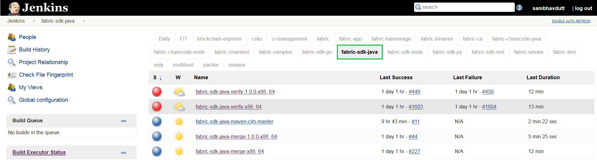
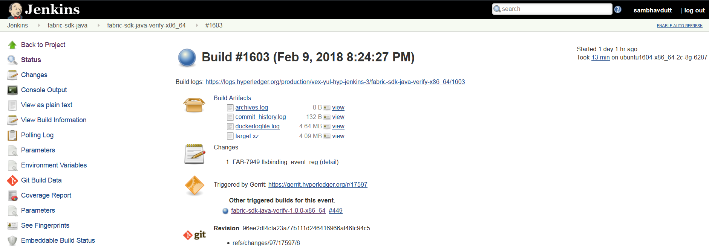

Fabric-SDK-Java
===============

This document explains about the fabric-sdk-java CI process. The below
steps explain what CI follows or executes when a patch set is submit to
the fabric-sdk-java repository.

Whenever a patchset is submitted to the fabric-sdk-java repository,
Jenkins triggers the CI build process to test and validate the patchset.
Fabric-sdk-java CI **verify and merge** jobs are configured to test the
patchset in the below environment.

The Hyperledger Fabric (and associated) projects utilize various tools
and workflows for continuous project development. Thefabric-sdk-java is
currently utilizing the following versions in the **Master** and
**Release-1.0** branches.

**Master**

-  go version: v1.9.2

-  docker version: 17.12.0-ce

**Release-1.0**

-  go version: v1.9.2

-  docker version: 17.12.0-ce

If you would like to know more details on the tool versions, you can
refer from any fabric-sdk-java jobs listed here
`fabric-sdk-java <https://jenkins.hyperledger.org/view/fabric-sdk-java/>`__,
Select one of the jobs, Click on any build number in the bottom left and
view the output for details.

Build Process
~~~~~~~~~~~~~

There are several Jenkins job types that are common across Hyperledger
Fabric projects. In some cases, you may or may not see all of the common
job types in every project. This depends on the specific needs of that
Hyperledger Fabric project. The CI configuration is prepared in Jenkins
Job Builder to create, update and modify the Jenkins Jobs.

As part of the CI process, we create JJB’s (Jenkins Job Builder) in YAML
format to configure Jenkins jobs. JJB has a flexible template system, so
creating many similar jobs with a common configuration is easy. More
about Jenkins Job Builder is available on `the JJB
webpage <https://docs.openstack.org/infra/jenkins-job-builder/>`__.

The following explains what happens when we submit a patch to the
**fabric-sdk-java** repository.

When a patchset is submitted to
`fabric-sdk-java <https://jenkins.hyperledger.org/view/fabric-sdk-java/>`__
repository, the Hyperledger Community CI server (Jenkins) triggers
**Verify** and jobs on **x86_64** platform using the patchset’s parent
commit which may or may not be the latest commit on **fabric-sdk-java**.

`fabric-sdk-java-verify-x86_64 <https://jenkins.hyperledger.org/view/fabric-sdk-java/job/fabric-sdk-java-verify-x86_64/>`__

`fabric-sdk-java-verify-1.0.0-x86_64 <https://jenkins.hyperledger.org/view/fabric-sdk-java/job/fabric-sdk-java-verify-1.0.0-x86_64/>`__

As part of the CI process on **fabric-sdk-java** repository, the
following tests are executed on **x86_64**\ (x) platform, see the arch
value at the end of the job name to know on which platform we run this
job.

   Views

**Below is the process we execute in CI on fabric-sdk-java verify and
merge jobs:**

Step 1: - Clone Fabric & Fabric-ca repositories:

-  Clone the latest commit from the Gerrit for Fabric and Fabric-ca
   repositories.

-  Check if the repositories are on the latest commit and the specified
   branch the tests must execute on. Checkout to the branch that is
   specified. Build the images with ``make docker`` command to build the
   latest docker images for Fabric & Fabric-ca.

Step 2: - When the images are ready, execute the cirun.sh script in the
/src/test directory of fabric-sdk-java

-  Export environment settings, wait time for SDK test integration.

-  With the latest JSDK version, now that we have the latest images for
   Fabric and Fabric-ca, run the java integration tests.

   For the **fabric-sdk-java-verify-1.0.0-x86_64** or
   **fabric-sdk-java-merge-1.0.0-x86_64** jobs,

-  This job is to run the integration tests using the latest JSDK
   version with Fabric & Fabric-ca 1.0.0 version. A check is made to
   verify if the tests have to execute on Fabric & Fabric-ca 1.0.0
   docker images.

-  The version for Fabric and Fabric-ca is set to 1.0.0. The 1.0.0
   version docker images are fetched for Fabric and Fabric-ca. The
   Fabric generated configuration version is set to v1.0

Step 3: - Execute the docker compose file from the
/src/test/fixture/sdkintegration/fabric.sh

-  Clean up the unnecessary containers/images if any with the *clean()*
   function.

-  Bring the network up with function *up()* , this executes the
   docker-compose up and creates the docker containers.

-  Bring down the network and start it again, wait till the containers
   are started, and execute the java integration tests.

Above process is applicable to both **verify** and **merge**
jobs.

After the builds are executed successfully, it sends a voting to Gerrit
patch set with a +1, or -1 if the build fails.

Once the patchset is approved by CI and the maintainers, they will merge
the patchset which triggers the Merge jobs and runs the above mentioned
tests on the latest fabric-sdk-java commit (doesn’t use the patchset’s
parent commit).

After the tests are executed, It is time to archive the logs (artifacts)
and publish the code coverage. CI publishes the logs(artifacts) and the
Code Coverage report(JaCoCo Coverage Report)on Jenkins console.

   ConsoleOutPut

Build Notifications
~~~~~~~~~~~~~~~~~~~~~

The build results can be viewed on the Jenkins console, where depending
on the result it displays with a colored bubble (green for success, red
for failure) and a vote from the CI (+1 or -1) on the Gerrit
commit/change.

Also, it sends out an email notification to all the fabric-sdk-java
maintainers in case of merge job failure.

Trigger failed jobs through Gerrit comments
~~~~~~~~~~~~~~~~~~~~~~~~~~~~~~~~~~~~~~~~~~~

Re-trigger of builds is possible in Jenkins by entering **reverify** in
a comment to the Gerrit change that re-triggers all the verify jobs. To
do so, follow the below process:

Step 1: Open the Gerrit patchset for which you want to reverify the
build

Step 2: Click on **Reply**, then type **reverify** and click **Post**

This kicks off all the fabric-sdk-java verify jobs. Once the build is
triggered, verify the Jenkins console output and go through the log
messages if you are interested to know how the build is making progress.

In some cases, Jenkins may fail only in one or two CI jobs due to which
network issues. In such cases, restarting all the fabric-sdk-java jobs
through ``reverify`` comment is not necessary. Instead, the developer
can post below comment to trigger the particular failed build:

-  reverify-x - to retrigger the build on fabric-sdk-java-verify-x86_64.
-  reverify-1.1.0 - to retrigger the build on
   fabric-sdk-java-verify-1.0.0-x86_64.

Questions
~~~~~~~~~

Please reach out to us in https://chat.hyperledger.org/channel/ci-pipeline or
https://chat.hyperledger.org/channel/fabric-ci RC channels for Questions or concerns related to
fabric-sdk-java CI process.
