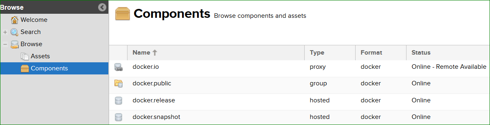
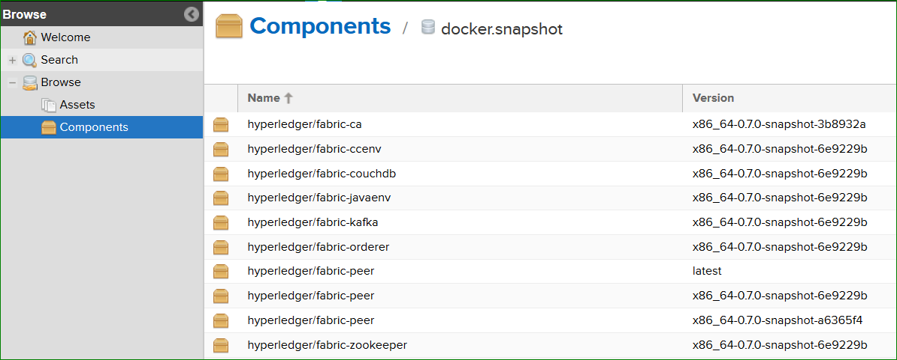

Publish Docker Images to Nexus3
===============================

We publish v1.0 docker images to Nexus repository for quicker and better
usage of docker images and this also reduces time to build images
manually. Once the images are stable, we publish them to
**docker.release** component based on the release plan. Below is the
process we follow in CI and instructions are provided to pull these
images.

We have a script to pull all these images, re-tag it to Hyperledger
images then delete Nexus Docker images from machine.

Jenkins CI publishes below listed Docker images to [Daily Snapshots]
(https://nexus3.hyperledger.org) after every successful end-to-end tests of CLI, NODE, JAVA. Example:

   nexus

Daily snapshots are pushed to Nexus3 from port 10003 into
docker.snapshot.

nexus-docker CI job executes below steps:

Build & Push Docker images
~~~~~~~~~~~~~~~~~~~~~~~~~~~

-  Clone **latest** commit from Fabric repository
   ``git clone ssh://hyperledger-jobbuilder@gerrit.hyperledger.org:29418/fabric``

-  Run ``make docker`` to build v1.0 Docker images

-  Tag ``hyperledger/fabric-$IMAGE_NAME`` to Nexus as mentioned below

   ::

       docker tag $ORG_NAME-$IMAGE_NAME:latest $NEXUS_URL/$ORG_NAME-$IMAGE_NAME:$FABRIC_SNAPSHOT_TAG

-  Push Docker images to Nexus as mentioned below

   ::

       docker push $NEXUS_URL/$ORG_NAME-$IMAGE_NAME:$FABRIC_SNAPSHOT_TAG

After images are published to docker.snapshot component, developers has
to pull Docker images from nexus repository. Follow the below steps to
download Docker images from NEXUS repository.

You can see image references here

   Docker Images

Pull Docker Images
~~~~~~~~~~~~~~~~~~

To pull Docker images from Nexus repository, follow below steps

-  Login as docker user

   -  *docker login -u docker -p docker nexus3.hyperledger.org:10001*

   -  *docker pull
      nexus3.hyperledger.org:10001/\ :math:`ORG_NAME-`\ IMAGE_NAME:$FABRIC_SNAPSHOT_TAG*

Example:

``docker pull nexus3.hyperledger.org:10001/hyperledger/fabric-peer:x86_64-0.7.0-snapshot-6e9229b``

Use 10001 for any read/pull requests. Port 10002 and 10003 are used
strictly for pushing images and not pulling.

Re-Tag Docker Images
~~~~~~~~~~~~~~~~~~~~~

After pulling the Docker images, follow below steps to re-tag Nexus tag to
hyperledger

-  Re-Tag

   -  ``docker tag $NEXUS_URL/$ORG_NAME-$IMAGE_NAME:$FABRIC_SNAPSHOT_TAG hyperledger/fabric-$IMAGE_NAME:$SNAPSHOT_TAG``

   -  ``docker tag $NEXUS_URL/$ORG_NAME-$IMAGE_NAME:latest hyperledger/fabric-$IMAGE_NAME:latest``

Example:

::

    docker tag nexus3.hyperledger.org:10001/hyperledger/fabric-peer:x86_64-0.7.0-snapshot-6e9229b
    hyperledger/fabric-peer:latest

Above process applies to **fabric-ca** Docker images as well.
